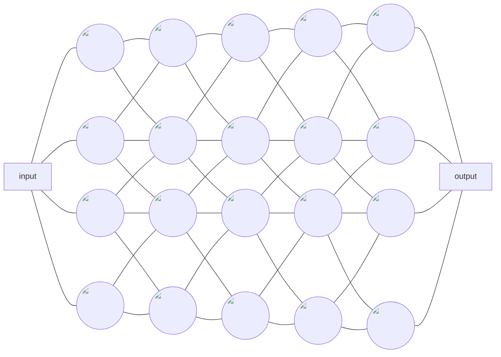

## NN with 4 inputs and 5 hidden layers

```mermaid
flowchart LR

1_1 --- 2_1
input --- 1_1
1_1 --- 2_2
1_1((<img src='./sample/1_1.png' height='80' style='border-radius:2em'>))
2_1 --- 3_1
2_1 --- 3_2
2_1((<img src='./sample/2_1.png' height='80' style='border-radius:2em'>))
3_1 --- 4_1
3_1 --- 4_2
3_1((<img src='./sample/3_1.png' height='80' style='border-radius:2em'>))
4_1 --- 5_1
4_1 --- 5_2
4_1((<img src='./sample/4_1.png' height='80' style='border-radius:2em'>))
5_1 --- output
5_1((<img src='./sample/5_1.png' height='80' style='border-radius:2em'>))
1_2 --- 2_2
input --- 1_2
1_2 --- 2_1
1_2 --- 2_3
1_2((<img src='./sample/1_2.png' height='80' style='border-radius:2em'>))
2_2 --- 3_2
2_2 --- 3_1
2_2 --- 3_3
2_2((<img src='./sample/2_2.png' height='80' style='border-radius:2em'>))
3_2 --- 4_2
3_2 --- 4_1
3_2 --- 4_3
3_2((<img src='./sample/3_2.png' height='80' style='border-radius:2em'>))
4_2 --- 5_2
4_2 --- 5_1
4_2 --- 5_3
4_2((<img src='./sample/4_2.png' height='80' style='border-radius:2em'>))
5_2 --- output
5_2((<img src='./sample/5_2.png' height='80' style='border-radius:2em'>))
1_3 --- 2_3
input --- 1_3
1_3 --- 2_2
1_3 --- 2_4
1_3((<img src='./sample/1_3.png' height='80' style='border-radius:2em'>))
2_3 --- 3_3
2_3 --- 3_2
2_3 --- 3_4
2_3((<img src='./sample/2_3.png' height='80' style='border-radius:2em'>))
3_3 --- 4_3
3_3 --- 4_2
3_3 --- 4_4
3_3((<img src='./sample/3_3.png' height='80' style='border-radius:2em'>))
4_3 --- 5_3
4_3 --- 5_2
4_3 --- 5_4
4_3((<img src='./sample/4_3.png' height='80' style='border-radius:2em'>))
5_3 --- output
5_3((<img src='./sample/5_3.png' height='80' style='border-radius:2em'>))
1_4 --- 2_4
input --- 1_4
1_4 --- 2_3
1_4((<img src='./sample/1_4.png' height='80' style='border-radius:2em'>))
2_4 --- 3_4
2_4 --- 3_3
2_4((<img src='./sample/2_4.png' height='80' style='border-radius:2em'>))
3_4 --- 4_4
3_4 --- 4_3
3_4((<img src='./sample/3_4.png' height='80' style='border-radius:2em'>))
4_4 --- 5_4
4_4 --- 5_3
4_4((<img src='./sample/4_4.png' height='80' style='border-radius:2em'>))
5_4 --- output
5_4((<img src='./sample/5_4.png' height='80' style='border-radius:2em'>))
```